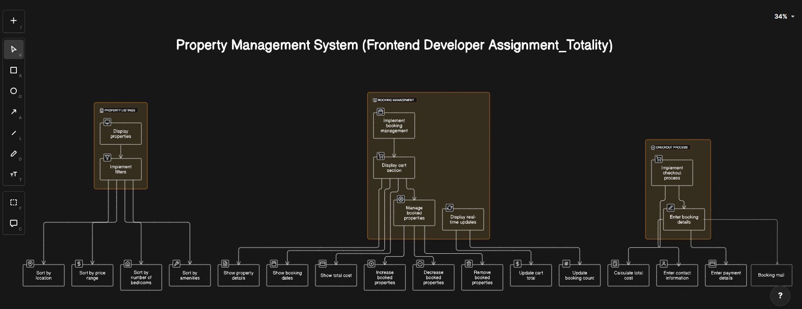

# Totality Frontend Challenge

This repository contains the solution for the Totality Frontend Challenge, which aims to develop a property rental platform with essential features using React. The challenge includes implementing property listings, booking management, checkout process, and ensuring responsive design.

## Property Management System Design

## Tech Stack

- **[React](https://reactjs.org/)**: A JavaScript library for building user interfaces.
- **[Next.js](https://nextjs.org/)**: A React framework for server-side rendering and routing.
- **[TypeScript](https://www.typescriptlang.org/)**: A typed superset of JavaScript for improved code quality and maintainability.
- **[MongoDB](https://www.mongodb.com/)**: A NoSQL database for storing property and user data.
- **[Node.js](https://nodejs.org/)** + **[Express](https://expressjs.com/)**: A backend framework for implementing server-side logic and APIs.
- **[Nodemailer](https://nodemailer.com/)**: A module for sending emails from Node.js, used for sending booking confirmation emails.
- **[Tailwind CSS](https://tailwindcss.com/)**: A utility-first CSS framework for styling the frontend components.
- **[Clerk.js](https://clerk.dev/)**: A Next.js integration for user authentication and identity management.
- **[Radix UI](https://radix-ui.com/)**: UI components library including dialogs, icons, select components, and sliders.
- **[Lucid React](https://lucid-dream.dev/)**: UI library icons.
- **[Framer Motion](https://www.framer.com/motion/)**: A React animation library for creating interactive UI.
- **[Mongoose](https://mongoosejs.com/)**: MongoDB object modeling for Node.js, used for managing MongoDB data models.
- **[clsx](https://github.com/lukeed/clsx)**: Utility for conditionally joining classNames together.
- **[Tailwind CSS Animate](https://github.com/bentzibentz/tailwindcss-animatecss)**: Tailwind CSS plugin for adding animation utilities.
- **[shadcn](https://ui.shadcn.com/)**: A UI library for adding components.
- **[aceternity](https://aceternity.io/)**: A UI library for enhancing component accessibility and usability.

## Features Implemented:

1. **Property Listings**:
   - Implement dynamic pagination for seamless navigation through dynamically loaded property listings.
   - Enable users to browse through multiple pages of dynamically fetched properties effortlessly.
   - Enhance user experience by providing intuitive dynamic pagination controls.

2. **Booking Management**:
   - Allow users to book properties and manage bookings in a cart section. Nodemailer is integrated for sending emails upon booking.
   - Real-time updates of cart total and booking count. Users can add and remove bookings.

3. **Checkout Process**:
   - Calculate the total cost of booked properties.
   - Collect booking details, including contact information and payment details, and send mail to the user about the booked property.

4. **Responsive Design**:
   - Ensure seamless functionality and optimal viewing experience across desktop and mobile devices. Further improvements can be made to enhance viewing on various screen sizes.

5. **User Authentication**:
   - Implement user registration and login functionalities with Clerk authentication.
   - Display the user's name and avatar when logged in.
   - Protect routes to prevent unauthorized access and provide a nice toast alert message when the user is not signed in.

## Additional Notes

- **Deployment**: The application is deployed on [Vercel](https://vercel.com/) at [homely hub](https://totality-frontend-challenge-mu.vercel.app/). A CI/CD pipeline is connected for a better development environment.
- **MongoDB**: MongoDB Atlas serves as the cloud database service for storing property and user data.
- **Next.js**: The utilization of Next.js for server-side rendering enhances performance and SEO, resulting in a smoother user experience.
- **TypeScript**: Integration of TypeScript ensures type safety, reducing bugs and enhancing code maintainability.
- **Nodemailer**: Nodemailer is configured to send booking confirmation emails to users upon successful booking.

## How to Run Locally

1. Clone this repository.
2. Navigate to the `totality-frontend-challenge` directory.
3. Run `npm install` to install dependencies.
4. Create a `.env` file in the root directory and add necessary environment variables.
5. Run `npm run dev` in the root directory to start the Development server.
6. Access the application at `http://localhost:3000`.

## Future Improvements:

- Implement property reviews and a favorites list feature.
- Enhance the checkout process with more payment options and validation.
- Improve error handling and user feedback.
- Enhance the UI/UX based on user feedback and usability testing.

All features mentioned above have been successfully implemented in the application. Feel free to explore the deployed application [here](https://totality-frontend-challenge-mu.vercel.app/), and the codebase on [GitHub](https://github.com/jyzib/totality-frontend-challenge).

